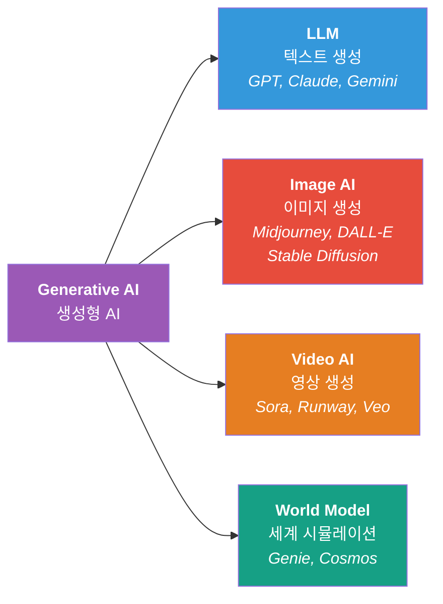
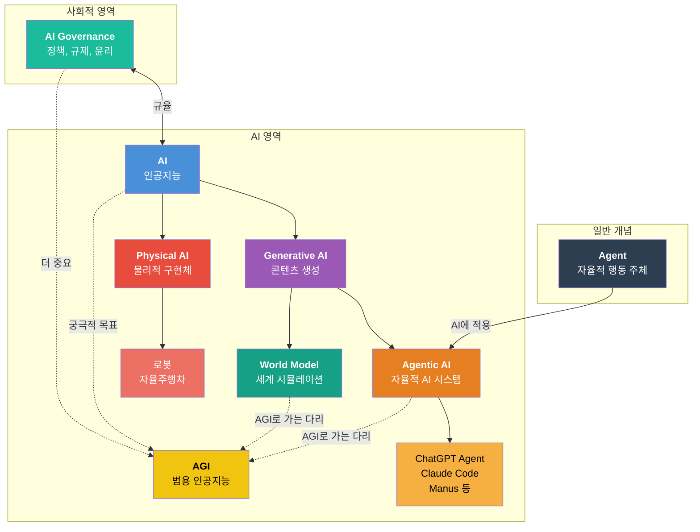
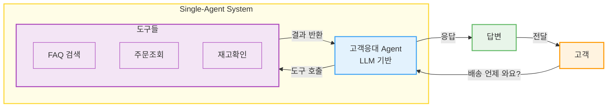
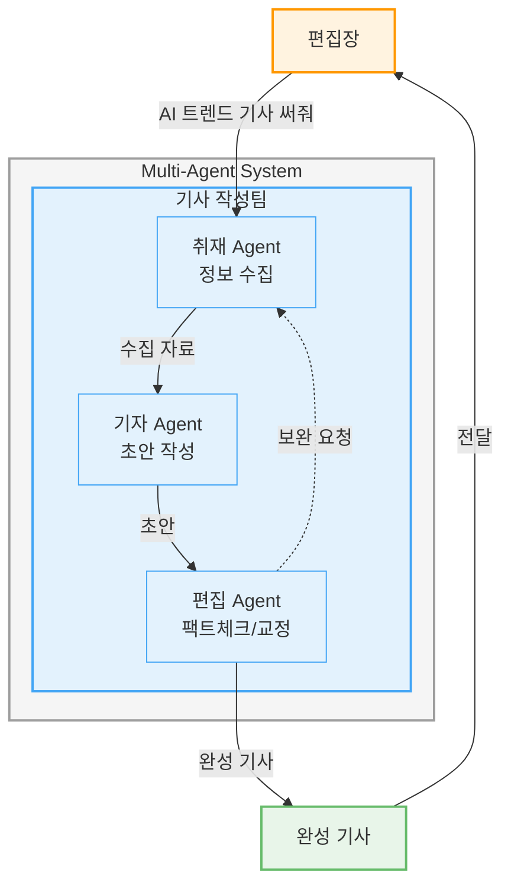
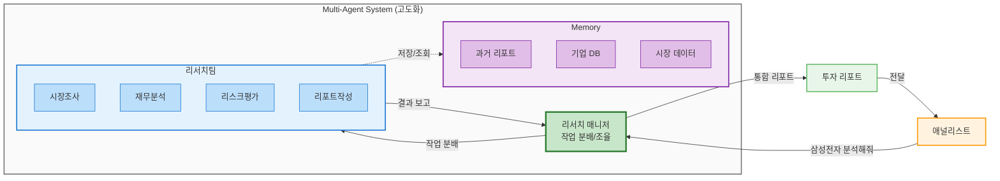
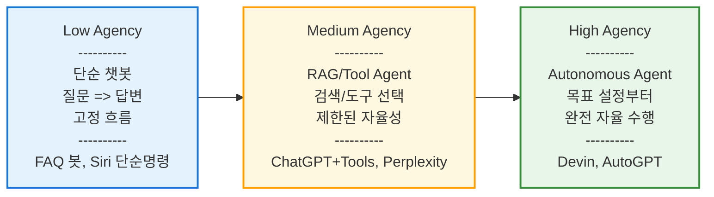
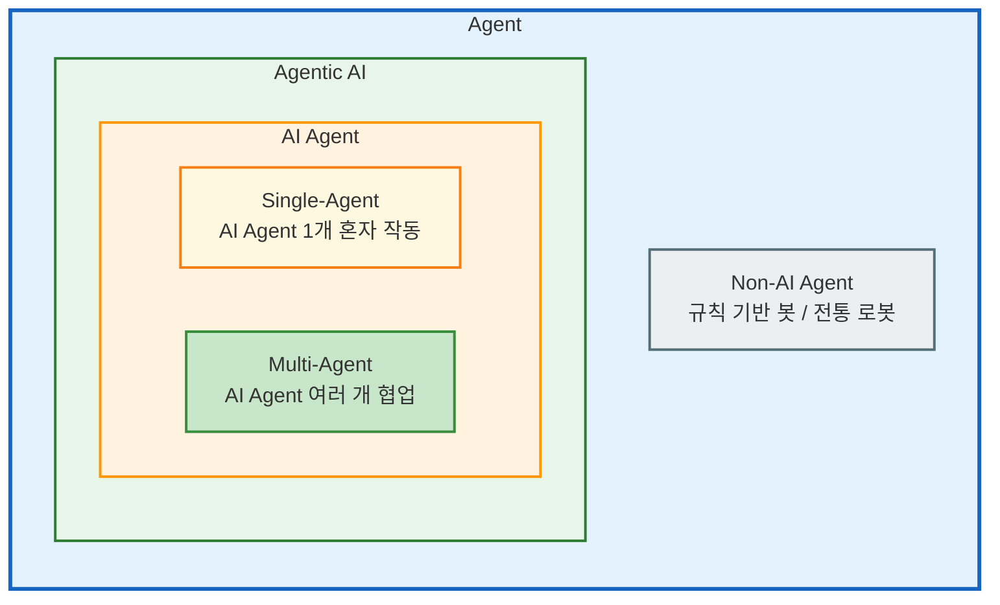
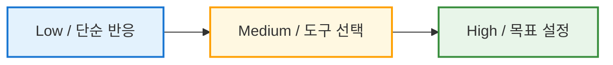

# Part 0. 용어로 이해하는 AI의 역사와 미래 흐름

## 개념 한줄 정리

| 개념 | 설명 |
| --- | --- |
| **AI (Artificial Intelligence)** | 인간의 지능(학습, 추론, 판단)을 모방하는 컴퓨터 시스템의 총칭 |
| **Generative AI** | 텍스트, 이미지, 코드 등 새로운 콘텐츠를 '생성'하는 AI (예: ChatGPT, Claude, Midjourney) |
| **Agent** | 환경을 인식하고 목표 달성을 위해 자율적으로 행동하는 주체 — AI뿐 아니라 로봇, 소프트웨어, 인간도 Agent가 될 수 있는 일반적 개념 |
| **Agentic AI** | Agent 개념을 AI에 적용한 시스템 — 도구 호출, 계획 수립, 다단계 작업을 자율적으로 수행 (예: ChatGPT Agent, Claude Computer Use, Manus) |
| **Physical AI** | 로봇, 자율주행차 등 물리적 세계에서 동작하는 신체를 가진 AI |
| **World Model** | 물리 세계의 원리를 이해하고 시뮬레이션할 수 있는 AI — Generative AI의 확장이자 AGI로 가는 핵심 기술 (예: Genie, Cosmos) |
| **AGI (Artificial General Intelligence)** | 인간과 동등한 범용 지능을 갖춰 모든 지적 과제를 수행할 수 있는 AI (아직 미실현) |
| **AI Governance** | AI 개발과 사용에 대한 정책, 규제, 윤리적 프레임워크 — 책임 있는 AI를 위한 사회적 합의 |

---

## Generative AI 세부 분류



---

## 개념 관계도



---


## 한국 AI 기본법

**정식 명칭:** 「인공지능 발전과 신뢰 기반 조성 등에 관한 기본법」 (2026년 1월 22일 시행)

AI Governance의 국내 구체적 사례입니다. AI 사업자가 준수해야 할 **5대 의무** 를 규정합니다.

| 의무 | 핵심 내용 |
| --- | --- |
| **1. 투명성 사전 고지** | 고영향 AI나 생성형 AI 기반 제품/서비스라는 사실을 이용자에게 사전 고지해야 합니다. 계약서, 사용설명서, 이용약관, 서비스 화면 등에 기재합니다. |
| **2. 생성물 표시** | AI가 생성한 결과물임을 표시해야 합니다. 일반 생성물은 사람이 인식할 수 있는 표시 또는 워터마크 등 기계 판독 방식 모두 가능하고, **딥페이크** 의 경우 이용자가 명확하게 인식할 수 있는 표시만 허용됩니다. |
| **3. 안전성/신뢰성 확보** | 위험관리방안 수립/운영, AI 설명 방안 수립/시행, 이용자 보호 방안 수립/운영, 고영향 AI에 대한 사람의 관리/감독을 이행해야 합니다. 관련 확인 문서를 작성하여 **5년간 보관** 하고, 주요 내용은 사업장이나 홈페이지에 게시해야 합니다 (영업비밀 제외 가능). |
| **4. AI 영향평가** | 고영향 AI가 사람의 기본권에 미치는 영향을 사전 평가할 수 있습니다. 영향평가를 실시한 제품/서비스는 **국가기관 조달에서 우선 고려** 됩니다. 자율적 평가이지만 공공조달 인센티브와 연결되어 사실상 유도하는 구조입니다. |
| **5. 국내 대리인 지정** | 해외 빅테크 기업은 국내 대리인을 지정해야 하며, 위반 시 **3,000만 원 이하 과태료** 가 부과됩니다. 한국 내 이용자 보호와 법적 책임 소재를 명확히 하기 위한 조치입니다. |

---

## Agent, Agentic AI, AI Agent 종합 정리

> 주의: 업계마다 용어 정의가 다릅니다. 이름보다 각 개념과 특징을 잘 숙지하세요.


### 1. Agent (에이전트)

**정의: 환경과 상호작용하는 자율적 시스템 (가장 넓은 일반 개념)**

Russell & Norvig의 *Artificial Intelligence: A Modern Approach* 에서:

> "An agent is anything that can be viewed as perceiving its environment through sensors and acting upon that environment through actuators."

AI 분야 **학계 표준 정의** 입니다. Agent의 핵심 속성:

- **인지(Perception)**: 환경으로부터 정보를 받아들임
- **행동(Action)**: 환경에 영향을 미치는 행위를 수행
- **자율성(Autonomy)**: 외부 개입 없이 스스로 작동
- **목표 지향성(Goal-directedness)**: 특정 목표 달성을 위해 행동

이 정의는 AI에 국한되지 않습니다. 규칙 기반 봇, 전통적 로봇, 소프트웨어 에이전트 등 모두 포함합니다.

---

### 2. Agentic AI (에이전틱 AI)

**정의: AI가 자율적으로 목표를 분해하고, 도구를 활용하며, 복잡한 작업을 수행하는 AI 시스템 또는 패러다임**

쉽게 말해, AI가 스스로 목표를 쪼개고, 필요한 도구를 활용해 복잡한 작업을 완수하는 시스템입니다.

> "Agentic AI systems represent a paradigm shift marked by multi-agent collaboration, dynamic task decomposition, persistent memory, and coordinated autonomy." — Sapkota et al. (2025)

**핵심 특성:**

| 특성 | 설명 |
| --- | --- |
| **자율성 (Autonomy)** | 사람의 개입 없이 스스로 판단하고 행동 |
| **목표 지향성 (Goal-oriented)** | 주어진 목표를 달성하기 위해 계획 수립, 상황에 따라 전략 수정 |
| **도구 활용 (Tool Use)** | 검색, 코드 실행, API 호출 등 외부 도구 사용 |
| **다중 에이전트 협업 (Multi-Agent Collaboration)** | 전문화된 여러 AI가 역할을 나눠 협력 |
| **동적 작업 분해 (Task Decomposition)** | 복잡한 목표를 하위 작업으로 자동 분해/배분 |
| **지속 메모리 (Persistent Memory)** | 작업 간/세션 간 맥락을 기억하고 활용 |
| **조율 (Orchestration)** | Orchestrator가 전체 흐름을 관장하며 조율 |

핵심: Agentic AI는 혼자(Single) 또는 협업(Multi) 모두 가능합니다.

---

### 3. AI Agent (AI 에이전트)

**정의: LLM 및 멀티모달 모델 기반으로 특정 작업을 수행하는 모듈형 시스템 (Building Block)**

쉽게 말해, Agentic AI 시스템을 구성하는 기본 구성요소(빌딩 블록)입니다.

> "AI Agents are typically designed as single-entity systems that perform goal-directed tasks by utilizing external tools, applying sequential reasoning, and integrating real-time information to complete well-defined functions." — Sapkota et al. (2025)

**"AI Agent"라는 용어는 문맥에 따라 두 가지 의미로 사용됩니다:**

| 관점 | 설명 | 예시 |
| --- | --- | --- |
| **빌딩 블록** | 더 큰 시스템의 구성 요소 | Agentic AI 내의 "검색 Agent", "분석 Agent" |
| **독립 시스템** | 단독으로 작동하는 완결된 시스템 | ChatGPT, GitHub Copilot |

**AI Agent와 시스템의 관계:**

```
Agentic AI (자율적 AI 시스템)
    |
    +-- AI Agent 1개로 구성 ----> Single-Agent System
    |
    +-- AI Agent 여러 개로 구성 -> Multi-Agent System
```

---

### 4. Single-Agent System (단일 에이전트 시스템)

**정의: 하나의 AI Agent가 독립적으로 작업을 수행하는 Agentic AI 시스템**

쉽게 말해, 한 명의 전문가가 혼자서 모든 일을 처리하는 것입니다.

| 특징 | 설명 |
| --- | --- |
| **구조** | 단일 LLM + 도구(Tool: 검색, 코드 실행, DB 쿼리 등) |
| **에이전트 수** | 1개 |
| **협업** | 없음 (독립 작동) |
| **메모리** | 세션 단위 (대화가 끝나면 잊어버림) |

**아키텍처 예시: 고객 문의 응대 AI**



> 흐름: 고객이 "배송 언제 와요?"라고 문의하면, AI Agent가 주문조회 도구를 호출하여 배송 상태를 확인하고 답변합니다.

**예시:** ChatGPT, GitHub Copilot, Claude with Tools, RAG 기반 Q&A 시스템

---

### 5. Multi-Agent System (멀티 에이전트 시스템)

**정의: 여러 AI Agent가 협업하여 복잡한 목표를 달성하는 Agentic AI 시스템**

쉽게 말해, 여러 명의 전문가가 서로 대화하며 협력하는 것입니다.

| 특징 | 설명 |
| --- | --- |
| **구조** | 복수의 AI Agent |
| **에이전트 수** | 2개 이상 |
| **협업** | 에이전트 간 메시지 교환 |
| **Orchestrator** | 선택적 - 여러 에이전트에게 작업을 분배하고 조율하는 "프로젝트 매니저" 역할 |

**아키텍처 예시: 뉴스 기사 작성 AI**



> 흐름: 취재 Agent가 최신 정보를 수집 => 기자 Agent가 초안 작성 => 편집 Agent가 팩트체크 후 완성. 부족하면 취재 Agent에게 보완 요청합니다.

**고도화된 Multi-Agent 추가 구성요소:**

| 구성요소 | 설명 |
| --- | --- |
| **Orchestrator** | 프로젝트 매니저 - 누가 무슨 일을 할지 정하고 조율 |
| **Persistent Memory** | 세션이 끝나도 유지되는 장기 기억 저장소 |
| **Dynamic Task Decomposition** | 유연한 업무 분배 - 상황에 따라 일을 쪼개고 재배치 |

**고도화 아키텍처 예시: 투자 리서치 AI**



**핵심 흐름:**

```
사용자 => Orchestrator(PM) => 전문 Agents 분배 => 결과 수집 => 통합 응답
```

---

### 6. Agency (에이전시)

**정의: Agent가 가진 자율성의 정도 (별개의 축)**

쉽게 말해, 직원에게 부여된 "재량권"의 크기입니다.

위 개념들과 **별개의 차원** 입니다. Agent/AI Agent/System들이 "무엇(what)"을 말한다면, Agency는 **"어느 정도(how much)"** 를 말합니다.

**Agency 스펙트럼:**



| Agency 수준 | 비유 | 설명 |
| --- | --- | --- |
| **Low** | 인턴 | 시키는 일만 함 |
| **Medium** | 대리 | 어느 정도 판단해서 처리 |
| **High** | 임원 | 스스로 목표 설정하고 결정 |

---

### 7. 전체 개념 관계도



| 개념 | 설명 | 예시 |
| --- | --- | --- |
| **Agent** | 환경을 인지하고 행동하는 자율 시스템 | 모든 자율 시스템 |
| **Agentic AI** | 자율성/목표지향성/도구사용 특성을 가진 AI 패러다임 | Claude, ChatGPT, AutoGen |
| **AI Agent** | Agentic AI의 기본 구성요소 | 검색 Agent, 코딩 Agent, 분석 Agent |
| **Single-Agent** | AI Agent 1개가 혼자 작동하는 시스템 | ChatGPT, Copilot |
| **Multi-Agent** | AI Agent 여러 개가 협업하는 시스템 | AutoGen, MetaGPT, CrewAI |
| **Non-AI Agent** | 규칙 기반 시스템 | 전통 로봇, RPA |

> 핵심: "Agentic"은 에이전트 수와 무관한 특성입니다. 혼자 작동하든(Single), 여러 개가 협업하든(Multi), 자율적으로 목표를 추구하고 도구를 활용하면 Agentic AI입니다.

**Agency - 자율성의 정도 (별개의 축)**



> Agency는 Agent/AI Agent/System과 별개의 차원입니다. "무엇(what)"이 아니라 "어느 정도(how much)" 자율적으로 행동하는가를 나타냅니다.

---

### 8. 진화 관점의 관계도

AI 시스템은 Reactive(반응적) => Proactive(선제적) 방향으로 진화해왔습니다.

**Reactive vs Proactive AI:**

| 구분 | Reactive AI | Proactive AI |
| --- | --- | --- |
| **동작 방식** | 사용자 질문 => 답변 | 맥락을 파악하고 필요한 행동을 먼저 실행 |
| **특징** | 시키는 것만 수행 | 스스로 판단해서 선제적으로 제안/실행 |
| **예시** | "날씨 알려줘" => 날씨 검색 | 야외 일정 확인 => 먼저 날씨 알림 |

**구체적 예시:**

| 시나리오 | Reactive (일반 챗봇) | Proactive (Agentic AI) |
| --- | --- | --- |
| "내일 부산 출장이야" | "네, 알겠습니다" | KTX 예약 + 날씨 확인 + 근처 식당 추천 + 캘린더 등록 |
| "이 코드 리뷰해줘" | 코드 리뷰만 수행 | 리뷰 + 버그 수정 제안 + 테스트 코드 생성 + 문서화 |

> Proactive의 핵심: "시키지 않아도 필요한 걸 알아서 하는 것"

**진화 단계:**

```mermaid
flowchart LR
    subgraph Reactive["Reactive"]
        direction TB
        subgraph Stage1["1단계 Generative AI"]
            direction TB
            G1["콘텐츠 생성"]
            G2["Stateless"]
        end
    end

    subgraph Transition["전환"]
        direction TB
        subgraph Stage2["2단계 Single-Agent"]
            direction TB
            S1["도구 활용"]
            S2["작업 특화"]
        end
    end

    subgraph Proactive["Proactive"]
        direction TB
        subgraph Stage3a["3단계 Multi-Agent"]
            direction TB
            M1["역할 분담"]
            M2["협업"]
            M3["동적 작업 분해"]
            M4["자율적 조율"]
        end
    end

    Stage1 -- "+ Tool Use" --> Stage2
    Stage2 -- "+ 협업" --> Stage3a

    style Reactive fill:#FFEBEE,stroke:#EF5350,stroke-width:2px
    style Transition fill:#FFF8E1,stroke:#FFA000,stroke-width:2px
    style Proactive fill:#E8F5E9,stroke:#388E3C,stroke-width:2px
    style Stage1 fill:#FFCDD2,stroke:#E53935
    style Stage2 fill:#FFE0B2,stroke:#FB8C00
    style Stage3a fill:#C8E6C9,stroke:#43A047,stroke-width:2px
    style M1 fill:#C8E6C9,stroke:#43A047
    style M2 fill:#C8E6C9,stroke:#43A047
    style M3 fill:#C8E6C9,stroke:#43A047
    style M4 fill:#C8E6C9,stroke:#43A047
```



| 단계 | 성격 | 추가된 기능 | 핵심 변화 |
| --- | --- | --- | --- |
| 1단계 Generative AI | Reactive | - | 프롬프트에 반응하여 콘텐츠 생성 |
| 2단계 Single-Agent | 전환기 | + Tool Use | 외부 도구를 활용하여 작업 수행 |
| 3단계 Multi-Agent | Proactive | + 협업 | 역할 분담과 자율적 조율로 복잡한 작업 수행 |

---