# 쿠팡 선크림 제품 비교 분석 종합 리포트

> **분석 대상:** 쿠팡 선크림 리뷰 데이터  
> **분석 제품:** 3개 제품 비교  
> **분석 방법:** 텍스트 통계 + 시각화 차트 멀티모달 AI 분석

---

## 목차

1. [경영진 요약](#1-경영진-요약)
2. [시각화 분석](#2-시각화-분석)
3. [제품 순위](#3-제품-순위)
4. [측면별 인사이트](#4-측면별-인사이트)
5. [감정 분석](#5-감정-분석)
6. [키워드 연관성 분석](#6-키워드-연관성-분석)
7. [주요 트렌드](#7-주요-트렌드)
8. [개선 제안](#8-개선-제안)
9. [시장 분석](#9-시장-분석)
10. [위험 요소](#10-위험-요소)

---

## 1. 경영진 요약

시슨드시 선크림은 사용감과 기능성에서 압도적 만족도(평점 4.95)를 보이나 가성비 개선이 필요함. 피지오겔은 가성비와 대용량으로 우수하나 눈시림 및 자극 이슈가 심각함. 이자녹스는 톤업/커버력 기능이 강점이나 건조함과 트러블 이슈가 존재함. 전반적으로 시슨드시는 프리미엄 사용감, 피지오겔은 가성비, 이자녹스는 기능성으로 포지셔닝됨. 각 제품은 타겟 고객층이 명확하며, 약점 보완을 위한 성분/포뮬러 개선이 시급함.

## 2. 시각화 분석

### 2-1. 평균 평점 및 추천도 비교

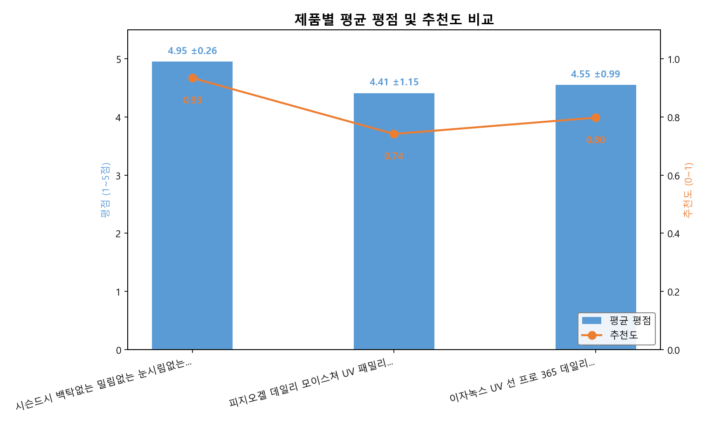

> **데이터 관찰:** 시슨드시 평점 4.95, 추천도 0.93으로 3개 제품 중 가장 높음. 피지오겔은 평점 4.41, 추천도 0.74로 가장 낮음.
>
> **비즈니스 시사점:** 시슨드시가 압도적인 제품 만족도와 충성도를 확보하고 있음을 시사함.

### 2-2. 감정 분포 비교

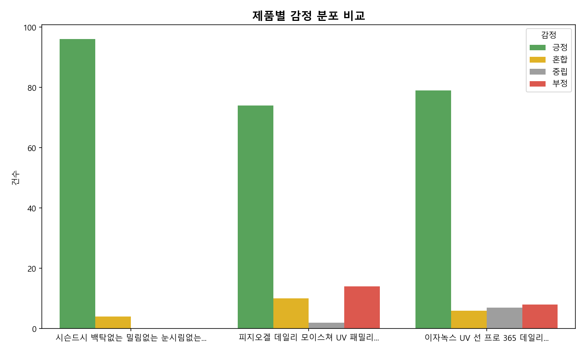

> **데이터 관찰:** 시슨드시의 긍정 리뷰가 압도적. 피지오겔은 부정 리뷰 건수가 가장 많음.
>
> **비즈니스 시사점:** 시슨드시의 긍정적 브랜드 경험이 매우 견고하며, 피지오겔은 개선이 필요한 부정적 이슈가 존재함.

### 2-3. 항목별 긍정 비율 히트맵

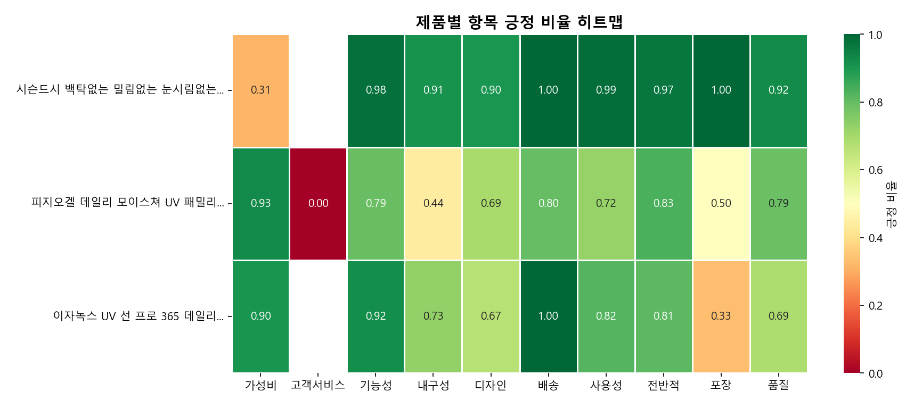

> **데이터 관찰:** 시슨드시 가성비 0.31(최하), 피지오겔 고객서비스 0.00(최하), 이자녹스 포장 0.33(최하).
>
> **비즈니스 시사점:** 제품별 강점과 약점이 명확히 갈림. 시슨드시(사용성/기능성) vs 피지오겔(가성비) vs 이자녹스(기능성/가성비).

### 2-4. 제품별 레이더 차트

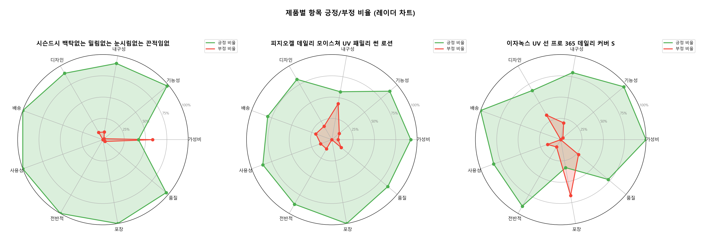

> **데이터 관찰:** 시슨드시의 긍정 비율 그래프가 전반적으로 100%에 근접하여 넓게 분포함.
>
> **비즈니스 시사점:** 시슨드시의 균형 잡힌 고품질 포지셔닝과 타 제품들의 특정 항목 편중 현상을 시각화함.

### 2-5. 장단점 워드클라우드

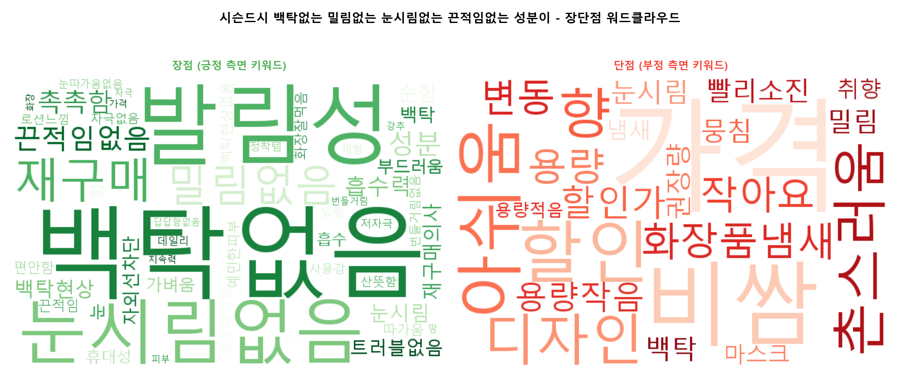

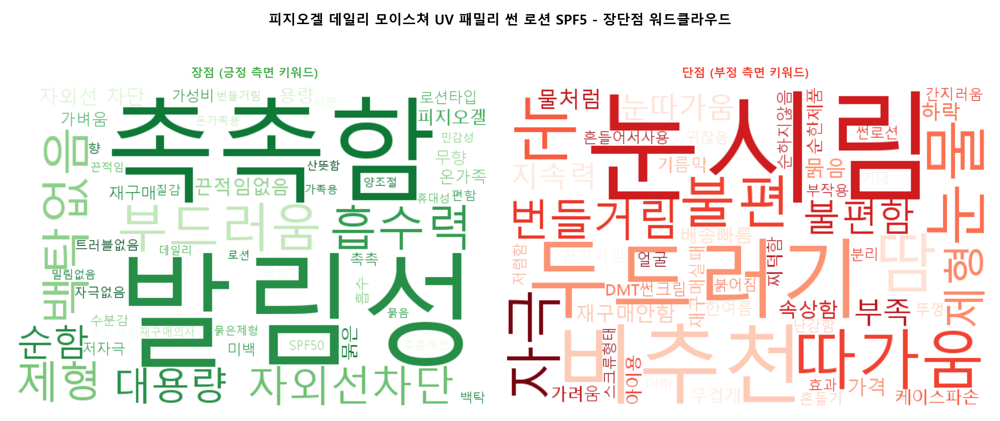

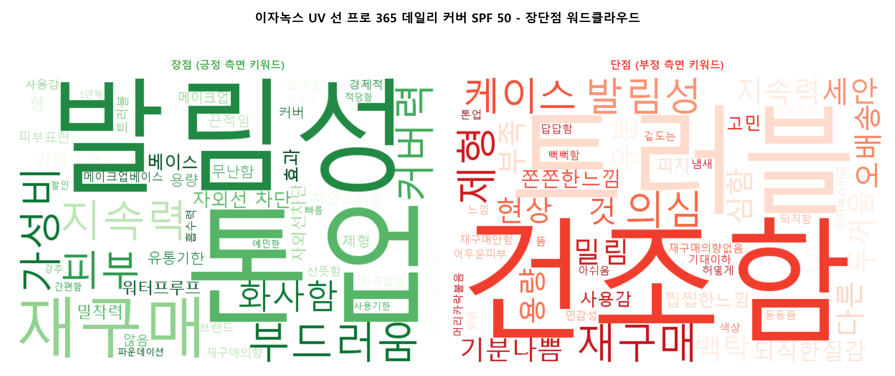

> **데이터 관찰:** 시슨드시: '백탁없음', '발림성' 강조. 피지오겔: '촉촉함', '대용량' 강조. 이자녹스: '톤업', '커버력' 강조.
>
> **비즈니스 시사점:** 소비자가 제품을 선택하는 핵심 기준(사용감 vs 가성비 vs 기능)을 명확히 파악 가능.

### 2-6. 측면별 키워드 분석

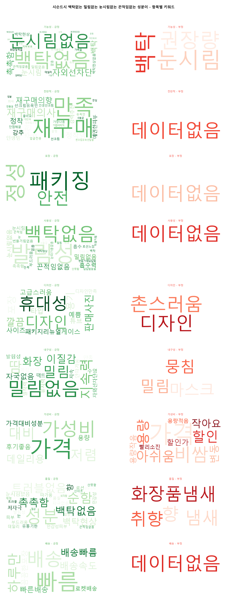

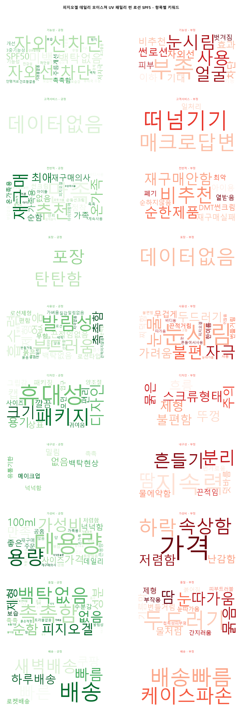

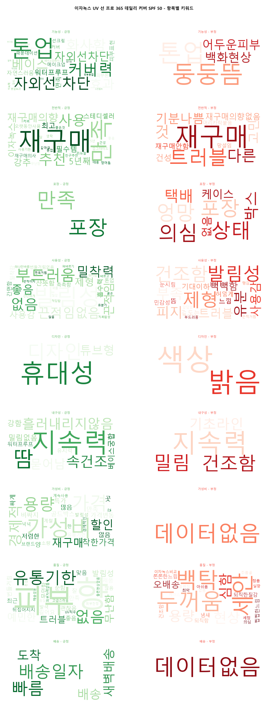

> **데이터 관찰:** 시슨드시의 긍정 키워드(발림성, 밀림없음)와 피지오겔의 부정 키워드(눈시림, 두드러기)가 대조적임.
>
> **비즈니스 시사점:** 제품별로 소비자가 느끼는 구체적인 긍정/부정 경험의 차이를 세분화하여 파악 가능.

### 2-7. 키워드 동시출현 분석

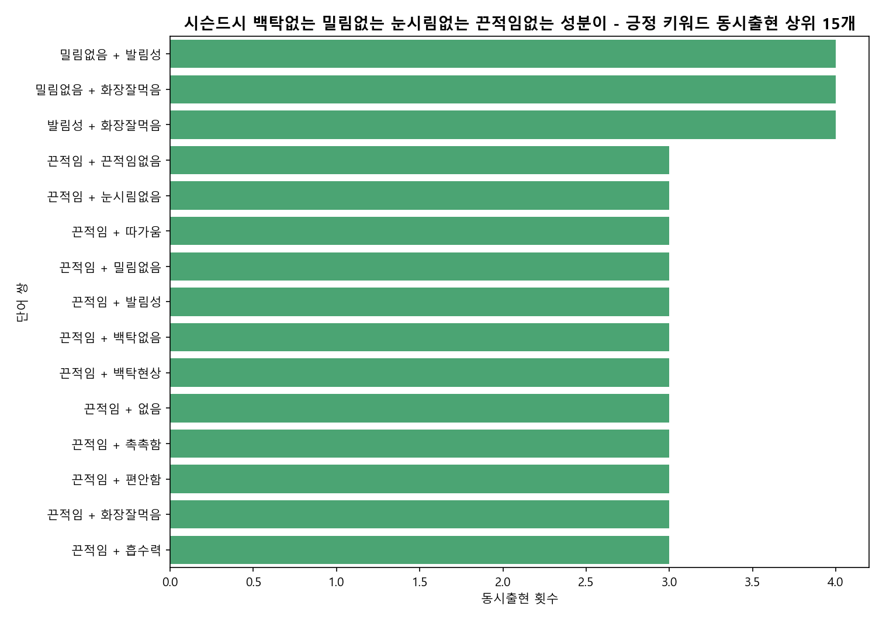

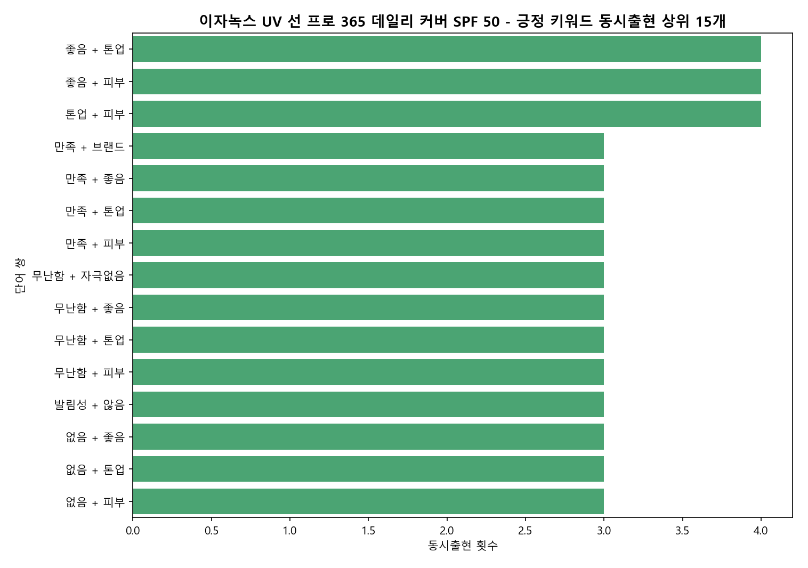

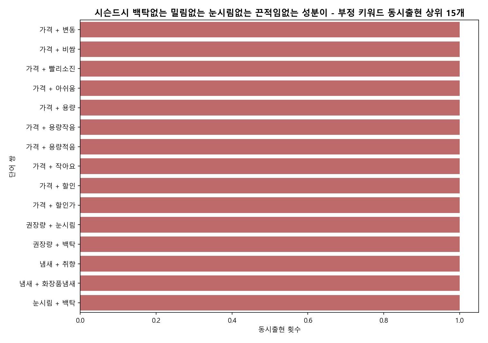

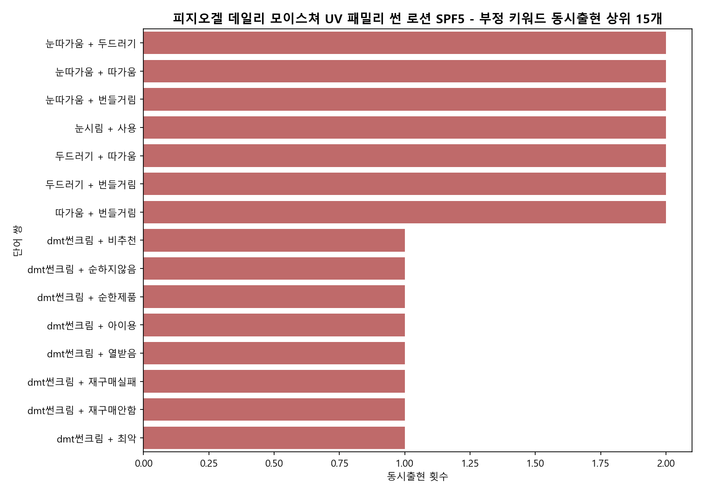

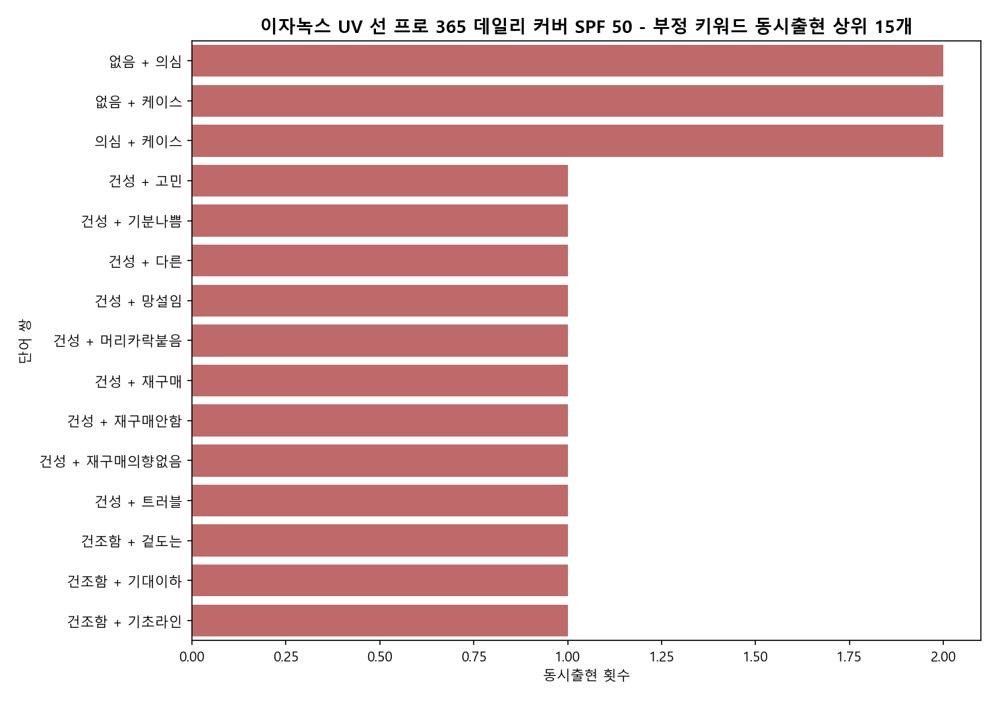

> **데이터 관찰:** 시슨드시: '밀림없음+화장잘먹음' 조합. 피지오겔: '가벼움+순함' 조합. 이자녹스: '좋음+톤업' 조합.
>
> **비즈니스 시사점:** 제품의 핵심 셀링 포인트와 치명적인 약점을 연결하는 키워드 조합을 파악하여 마케팅 메시지 최적화 가능.

## 3. 제품 순위

### 1위: 시슨드시 선크림

**종합 점수:** 평점 4.95, 추천도 0.93

**강점:**
- 백탁/밀림/끈적임 없는 최상의 사용감
- 눈시림 없는 순한 성분

**약점:**
- 상대적으로 높은 가격대 및 적은 용량

**핵심 키워드:**  `백탁없음`, `발림성`, `눈시림없음`, `밀림없음`, `끈적임없음`

**추천 대상:** 민감성 피부, 사용감을 최우선으로 하는 사용자

**비추천 대상:** 가격에 민감한 사용자

### 2위: 이자녹스 선 프로

**종합 점수:** 평점 4.55, 추천도 0.80

**강점:**
- 자연스러운 톤업 및 커버력
- 우수한 가성비와 지속력

**약점:**
- 피부 타입에 따른 건조함 및 트러블 유발 가능성

**핵심 키워드:**  `톤업`, `발림성`, `재구매`, `가성비`, `커버력`

**추천 대상:** 메이크업 베이스 겸용을 원하는 사용자

**비추천 대상:** 건조한 피부를 가진 사용자

### 3위: 피지오겔 선 로션

**종합 점수:** 평점 4.41, 추천도 0.74

**강점:**
- 우수한 가성비와 넉넉한 대용량
- 촉촉하고 부드러운 발림성

**약점:**
- 일부 사용자에게서 나타나는 눈시림 및 자극 현상

**핵심 키워드:**  `발림성`, `촉촉함`, `부드러움`, `대용량`, `순함`

**추천 대상:** 가성비를 중시하는 온 가족용 대용량 선케어 사용자

**비추천 대상:** 눈이 민감한 사용자

## 4. 측면별 인사이트

| 측면 | 최고 제품 | 최저 제품 | 긍정 비율 비교 |
|------|----------|----------|----------------|
| 전반적 | 시슨드시 선크림 | 이자녹스 선 프로 | 시슨드시 96.7% vs 이자녹스 80.9% vs 피지오겔 83.3% |
| 가성비 | 피지오겔 선 로션 | 시슨드시 선크림 | 피지오겔 92.6% vs 이자녹스 90.5% vs 시슨드시 31.2% |
| 사용성 | 시슨드시 선크림 | 피지오겔 선 로션 | 시슨드시 98.8% vs 이자녹스 82.1% vs 피지오겔 72.3% |
| 기능성 | 시슨드시 선크림 | 피지오겔 선 로션 | 시슨드시 98.2% vs 이자녹스 91.9% vs 피지오겔 79.5% |
| 품질 | 시슨드시 선크림 | 이자녹스 선 프로 | 시슨드시 92.3% vs 피지오겔 79.2% vs 이자녹스 68.6% |

- **전반적**: 시슨드시가 96.7%의 압도적인 긍정 비율로 전반적 만족도 1위 차지
- **가성비**: 피지오겔이 대용량과 합리적 가격으로 가성비 측면에서 가장 우수한 평가를 받음
- **사용성**: 시슨드시가 백탁, 밀림, 끈적임 없는 사용감으로 독보적인 만족도를 보임
- **기능성**: 시슨드시가 순한 성분과 자외선 차단 효과를 동시에 충족하여 기능성 만족도 1위 기록
- **품질**: 시슨드시가 성분 및 저자극 측면에서 가장 높은 평가를 받음

## 5. 감정 분석

- **가장 긍정적:** 시슨드시 백탁없는 밀림없는 눈시림없는 끈적임없는 성분이좋은 선크림 SPF
- **가장 부정적:** 피지오겔 데일리 모이스쳐 UV 패밀리 썬 로션

시슨드시는 긍정 리뷰가 압도적이나, 피지오겔은 부정 리뷰 건수가 가장 많아 품질 개선이 시급함. 이자녹스는 긍정적이나 건조함/트러블에 대한 중립/부정 리뷰가 존재함.

**공통 칭찬:**  `발림성 좋음`, `백탁없음/밀림없음`, `촉촉함/순함`

**공통 불만:**  `눈시림/눈따가움`, `가격/용량 불만족`, `건조함/트러블`

## 6. 키워드 연관성 분석

### 긍정 키워드 군집

- 백탁없음-밀림없음-끈적임없음-발림성
- 촉촉함-부드러움-흡수력-순함
- 톤업-커버력-화사함-지속력

### 부정 키워드 군집

- 눈시림-눈따가움-자극-두드러기
- 가격-비쌈-용량작음-아쉬움
- 건조함-트러블-밀림-두꺼움

### 제품 간 패턴

'발림성'은 모든 제품에서 긍정 키워드로 등장하나, '밀림'은 제품별로 긍정/부정 키워드로 나뉘어 사용감의 핵심 지표로 작용함.

## 7. 주요 트렌드

### 사용감 중시 트렌드

선크림 선택 시 '눈시림'과 '백탁' 여부가 가장 중요한 품질 판단 기준이 됨.

- 영향 제품:  시슨드시 선크림, 피지오겔 선 로션, 이자녹스 선 프로

### 가성비 중심 소비 패턴

가성비와 대용량 제품에 대한 선호도가 높으나, 이로 인해 품질(자극, 건조함) 이슈가 발생함.

- 영향 제품:  피지오겔 선 로션, 이자녹스 선 프로

### 기능성 다변화 트렌드

단순 차단을 넘어 톤업, 커버 등 메이크업 베이스 기능을 겸비한 제품 수요 증가.

- 영향 제품:  이자녹스 선 프로

## 8. 개선 제안

| 우선순위 | 제품 | 카테고리 | 제안 | 근거 | 예상 효과 |
|---------|------|---------|------|------|----------|
| 높음 | 시슨드시 선크림 | 가격 | 대용량 제품 출시 또는 다량 구매 시 할인 혜택을 제공하는 번들 패키지 구성으로 가성비 인식 개선 필요 | 가성비 긍정 비율 31.2%로 최하위 | 가격 민감 고객층의 만족도 제고 및 재구매율 유지 |
| 높음 | 피지오겔 선 로션 | 품질 | 눈시림 및 피부 자극을 유발하는 성분 재검토 및 저자극 포뮬러로의 개선 필요 | 눈시림, 자극 관련 부정 키워드 다수 출현 | 주요 불만 사항 해소 및 브랜드 신뢰도 회복 |
| 중간 | 이자녹스 선 프로 | 기능 | 보습 성분 강화 및 민감성 피부를 위한 저자극 테스트 완료 제품 라인업 확대 | 건조함, 트러블 관련 부정 키워드 출현 | 피부 타입별 고객 만족도 향상 및 이탈 방지 |
| 높음 | 피지오겔 선 로션 | 서비스 | 고객 문의 대응 프로세스 전면 개선 및 매크로 답변 지양, 실질적인 상담 인력 확충 필요 | 고객서비스 긍정 비율 0% | 고객 불만 대응력 강화 및 브랜드 이미지 개선 |

## 9. 시장 분석

### 포지셔닝

시슨드시: 프리미엄 사용감 중심의 고관여 민감성 피부 타겟. 피지오겔: 가성비와 대용량을 중시하는 온 가족용 매스 마켓 타겟. 이자녹스: 메이크업 베이스 기능을 원하는 화장 간소화 타겟. 각 제품은 명확한 타겟 고객층을 보유하고 있으며, 사용감(시슨드시), 가격(피지오겔), 기능(이자녹스)이라는 서로 다른 핵심 가치를 제공함.

### 경쟁 우위

시슨드시: 압도적인 사용감(백탁/밀림/끈적임 제로)과 순한 성분으로 민감성 피부 타겟의 강력한 팬덤 확보. 피지오겔: 대용량과 합리적 가격을 앞세운 가성비 전략으로 온 가족용 선케어 시장 점유. 이자녹스: 메이크업 베이스 기능을 겸비한 톤업/커버력으로 화장 단계를 줄이고자 하는 고객층 공략.

## 10. 위험 요소

- 피지오겔의 눈시림 및 피부 자극 이슈 (브랜드 이미지 타격 가능성)
- 이자녹스의 건조함 및 트러블 유발 가능성 (고객 이탈 요인)
- 시슨드시의 가성비 불만족 (가격 민감 고객층 이탈 위험)
- 전반적인 제품들의 포장 및 고객 서비스 품질 편차

---

*본 리포트는 쿠팡 리뷰 데이터 기반의 AI 분석이며,
텍스트 통계와 시각화 차트를 멀티모달로 종합 분석한 결과입니다.*