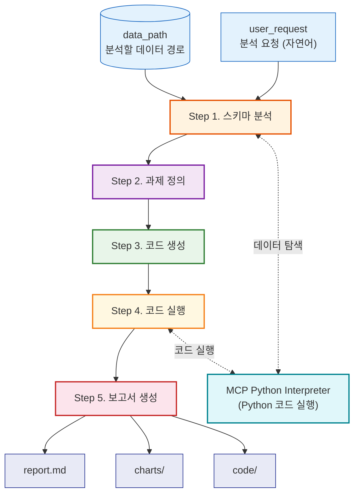
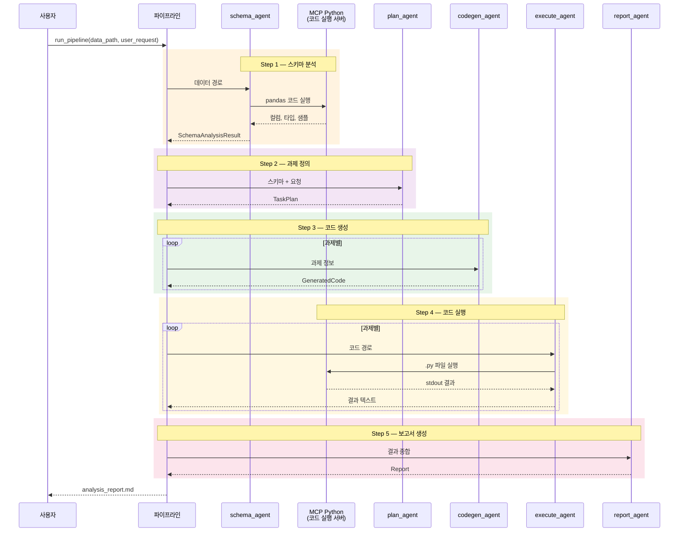

# PydanticAI 데이터 분석 자동화 Agent

PydanticAI + MCP를 활용한 5단계 데이터 분석 파이프라인입니다.  
데이터를 넣고 자연어로 요청하면, AI가 스키마 분석 → 과제 정의 → 코드 생성 → 실행 → 보고서까지 자동으로 수행합니다.

---

## 전체 아키텍처



### Agent 역할

| Step | Agent | 역할 | MCP | output_type |
|------|-------|------|:---:|-------------|
| **1** | `schema_agent` | MCP로 데이터 탐색 (pandas) → 구조화된 스키마 반환 | O | `SchemaAnalysisResult` |
| **2** | `plan_agent` | 스키마 + 사용자 요청 → 3~5개 분석 과제 설계 | | `TaskPlan` |
| **3** | `codegen_agent` | 과제별 실행 가능한 Python 코드 생성 | | `GeneratedCode` |
| **4** | `execute_agent` | 코드 검토 → 실행 → 오류 시 자가 수정 (최대 3회) | O | 텍스트 |
| **5** | `report_agent` | 실행 결과 종합 → 보고서 (결론/제언 포함) | | `Report` |

---

## 데이터 흐름 (시퀀스 다이어그램)



---

## 빠른 시작

### 1. 설치 (uv 권장)

```bash
# uv로 설치 (권장) - Python 3.12 가상환경 자동 생성
uv sync
```

> pip 사용 시 (참고):
> ```bash
> pip install pydantic-ai-slim[google] python-dotenv pydantic pyyaml pandas matplotlib
> ```

### 2. 환경 설정

`.env` 파일 (API 키만):

```env
GEMINI_API_KEY=your_api_key_here
```

모델/thinking level/재시도 등 설정은 `config/settings.yaml`에서 관리합니다.

### 3. 실행

```bash
uv run python agent_pipeline.py
```

### 4. 테스트

```bash
uv run python test_pipeline.py
```

---

## 파일 구조

```
pydanticai_analysis_agent/
├── pyproject.toml          # 프로젝트 설정 (uv, Python 3.12)
├── uv.lock                 # 의존성 잠금 파일
├── agent_pipeline.py       # 메인 파이프라인 (5단계)
├── test_pipeline.py        # 단위 테스트 (6개)
├── .env                    # API 키 (비밀 정보만)
│
├── config/                 # 설정 및 유틸리티
│   ├── settings.yaml       #   모델, thinking level, 재시도, 지연시간
│   ├── prompts.yaml        #   단계별 프롬프트 템플릿
│   └── utils.py            #   설정 로딩, 재시도 헬퍼, MCP 서버
│
├── schemas/                # Pydantic 스키마
│   ├── __init__.py         #   re-export
│   └── models.py           #   SchemaAnalysisResult, TaskPlan, Report 등
│
├── data/                   # 분석 대상 데이터
│   ├── tourism_data/       #   관광 데이터 (CSV 3개)
│   ├── h&m dataset/        #   H&M 거래 데이터 (CSV 3개)
│   └── chinook.db          #   SQLite 데이터베이스
│
└── outputs/                # 실행 결과 (자동 생성)
    ├── analysis_report.md
    ├── code/               #   스키마 분석 + 과제별 Python 코드
    ├── charts/             #   차트 이미지
    └── _temp/              #   단계별 중간 결과 (JSON)
```

---

## 사용 예시

### 기본 실행

```python
import asyncio
from agent_pipeline import run_pipeline

async def main():
    report = await run_pipeline(
        data_path="./data/tourism_data",
        user_request="한국 관광객 추세 분석",
        output_dir="./outputs",
        parallel=False,   # 무료 플랜은 순차 권장
        verbose=True,
    )

asyncio.run(main())
```

### 개별 Step 실행

```python
from agent_pipeline import step1_analyze_schema, step2_define_tasks

# Step 1만 실행
schema_obj = await step1_analyze_schema(
    "./data/tourism_data", "관광 분석", "./outputs"
)

# Step 2만 실행 (Step 1 결과를 JSON으로 변환하여 전달)
import json
schema_json = json.dumps(schema_obj.model_dump(), ensure_ascii=False, indent=2)
plan = await step2_define_tasks(
    schema_json, "관광 분석", "./data/tourism_data", "./outputs"
)
```

---

## 핵심 개념 (PydanticAI)

### 1. Agent + output_type (구조화된 출력)

```python
from pydantic_ai import Agent
from schemas import TaskPlan

# output_type을 지정하면 LLM 응답이 자동으로 Pydantic 모델로 변환됩니다
agent = Agent("google-gla:gemini-2.5-flash", output_type=TaskPlan)
result = await agent.run("분석 과제를 정의해주세요")

plan = result.output          # TaskPlan 객체
print(plan.goal)              # 문자열
print(plan.tasks[0].title)    # Task 객체 접근
```

### 2. MCPServerStdio (MCP 도구)

```python
from pydantic_ai import Agent
from pydantic_ai.mcp import MCPServerStdio

# MCP 서버 정의 - Agent 실행 시 자동으로 시작/종료됩니다
python_mcp = MCPServerStdio("uvx", args=["mcp-python-interpreter"])

# toolsets에 등록하면 Agent가 Python 코드를 실행할 수 있습니다
agent = Agent("google-gla:gemini-2.5-flash", toolsets=[python_mcp])
result = await agent.run("1부터 100까지 합계를 계산해주세요")
```


---

## 출력 결과

| 위치 | 내용 |
|------|------|
| `outputs/analysis_report.md` | 최종 마크다운 보고서 |
| `outputs/code/*.py` | 스키마 분석 + 과제별 Python 코드 |
| `outputs/charts/*.png` | 차트 이미지 |
| `outputs/_temp/step*.json` | 각 Step 중간 결과 |

**코드 파일명 규칙:**
- 스키마 분석: `analyze_schema.py` (Step 1에서 MCP가 자동 생성)
- 과제별 코드: `task_{번호}_{output_type}.py` (예: `task_1_chart.py`, `task_2_table.py`)

---

## 설정 (`config/settings.yaml`)

| 항목 | 설정 키 | 기본값 | 설명 |
|------|---------|--------|------|
| 모델 | `model.name` | `gemini-3.1-flash-lite-preview` | Gemini 모델명 |
| Temperature | `model.temperature` | `0` | 응답 일관성 |
| Thinking | `thinking.step_*` | `low` / `medium` / `high` | Step별 사고 깊이 |
| 재시도 | `retry.max_retries` | `3` | 최대 재시도 횟수 |
| 백오프 | `retry.base_delay` | `3.0` | 지수 백오프 기본 대기(초) |
| Step 대기 | `pipeline.step_delay` | `1.0` | Step 간 대기(초) |

> API 키는 `.env` 파일에 `GEMINI_API_KEY`로 설정합니다.
