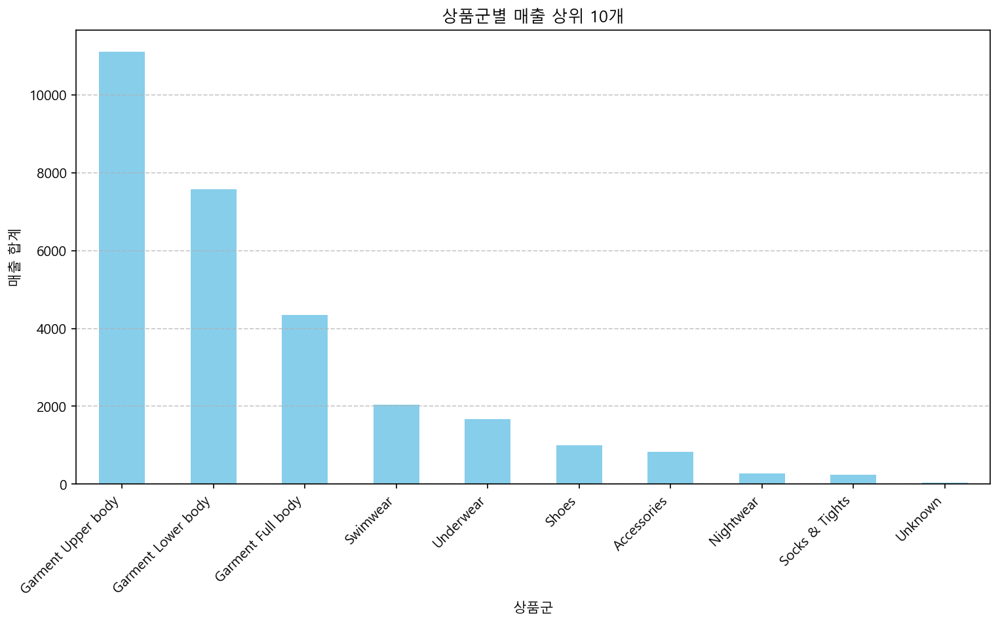
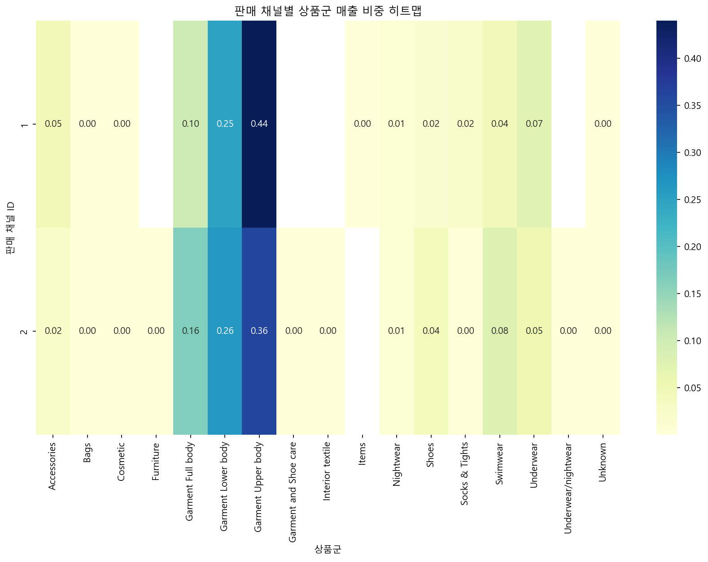

# H&M 매출 및 고객 행동 분석 보고서

> 생성 시간: 2026-04-09 17:45:47

## 분석 목표
채널, 상품군, 고객 속성별 매출 데이터를 분석하여 매출 특징과 주요 인사이트를 도출합니다.

## 데이터 출처
./data/h&m dataset/articles_hm.csv, ./data/h&m dataset/customer_hm.csv, ./data/h&m dataset/transactions_hm.csv

---

## 경영진 요약
H&M의 매출 데이터를 분석한 결과, 의류 상품군(상/하의)이 전체 매출의 약 64%를 견인하고 있으며, 특히 20대 ACTIVE 멤버십 고객층이 핵심 매출 동력으로 확인되었습니다. 판매 채널별로 상품군 선호도에 뚜렷한 차이가 있어, 채널별 맞춤형 상품 전략 수립이 필요합니다. 본 보고서는 매출 집중도가 높은 상품군과 고객층을 식별하고, 이를 바탕으로 한 구체적인 매출 증대 방안을 제언합니다.

## 주요 발견사항
- 'Garment Upper body'가 전체 매출의 38.12%로 1위를 차지하며, 상위 3개 상품군이 전체 매출의 약 79%를 점유함.
- 'ACTIVE' 멤버십을 가진 20대 고객층이 가장 높은 매출 기여도를 보임.
- 판매 채널 1과 2 모두 의류 상품군이 핵심이나, 채널별로 특정 상품군에 대한 매출 비중 차이가 존재함.

## 핵심 지표

| 지표명 | 값 | 변화 |
|--------|-----|------|
| Garment Upper body 매출 비중 | 38.12% | - |
| 상위 3개 상품군 매출 합계 비중 | 79.04% | - |
| 핵심 고객층 | 20대 / ACTIVE 멤버십 | - |

---

## 과제별 분석 결과

### 과제 1: 전체 매출 현황 및 채널별 비중

**질문:** 전체 매출 규모와 판매 채널(1, 2)별 매출 비중은 어떻게 되는가?

*'Garment Upper body'가 압도적인 1위를 차지하며, 상위 3개 상품군이 매출의 대부분을 점유하는 집중형 구조임.*

**인사이트:** 상의, 하의, 전신 의류가 매출의 대부분을 차지하는 의류 중심의 매출 구조를 보임.

### 과제 2: 상품군별 매출 성과 분석

**질문:** 어떤 상품군이 가장 높은 매출을 기록하고 있는가?

| 고객 그룹 | 매출 기여도 |
|---|---|
| 20대 / ACTIVE | 최상위 |
| 10대 / LEFT CLUB | 최하위 |

**인사이트:** 20대 ACTIVE 멤버십 고객이 매출을 주도하며, 멤버십 상태에 따른 매출 격차가 큼.

### 과제 3: 고객 속성(연령대, 멤버십)별 매출 특징

**질문:** 고객의 연령대와 멤버십 상태에 따라 매출에 차이가 있는가?

*'Garment Upper body'와 'Garment Lower body'가 모든 채널에서 가장 높은 비중을 차지하며, 특히 채널 1에서 상의 비중이 더 높게 나타남.*

**인사이트:** 채널 1과 2 모두 의류 상품군이 핵심이나, 채널별로 특정 상품군에 대한 선호도 비중이 상이함.

---

## 종합 결론
H&M의 매출은 특정 의류 상품군과 ACTIVE 멤버십을 보유한 20대 고객층에 고도로 집중되어 있습니다. 이러한 집중된 매출 구조를 바탕으로, 채널별 선호 상품군 차이를 반영한 타겟 마케팅을 강화하여 고객 경험을 최적화해야 합니다.

## 제언
1. 'Garment Upper body' 및 'Lower body' 상품군에 대한 재고 확보 및 프로모션 집중 (전체 매출의 64% 이상 차지).
2. 20대 ACTIVE 멤버십 고객을 대상으로 한 개인화된 마케팅 캠페인 강화 및 리텐션 프로그램 운영.
3. 채널별 매출 비중 차이를 고려하여, 채널 1과 2의 상품 구성(Merchandising)을 최적화하고 교차 판매 전략 수립.

---

## 참고사항
본 분석은 H&M 공개 데이터셋을 기반으로 수행되었습니다. 'Unknown' 등 일부 상품군은 매출 비중이 매우 낮아 전체적인 트렌드 분석에서 제외하거나 별도 관리하는 것이 효율적입니다. 향후 고객의 구매 주기 및 재구매율 분석을 추가하면 더 정교한 마케팅 전략 수립이 가능할 것입니다.
