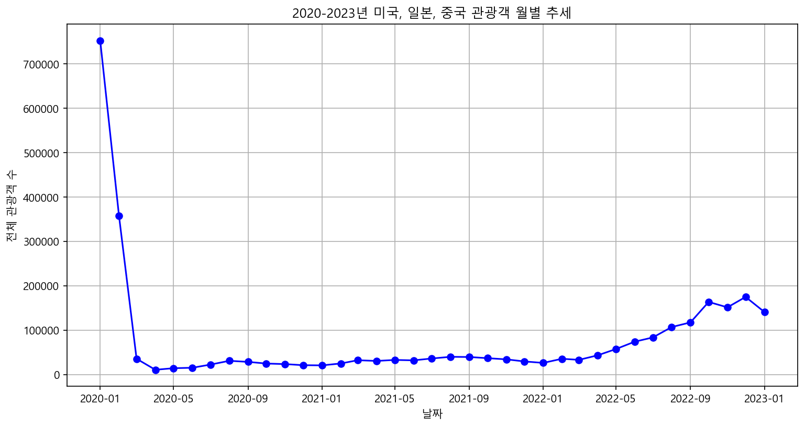
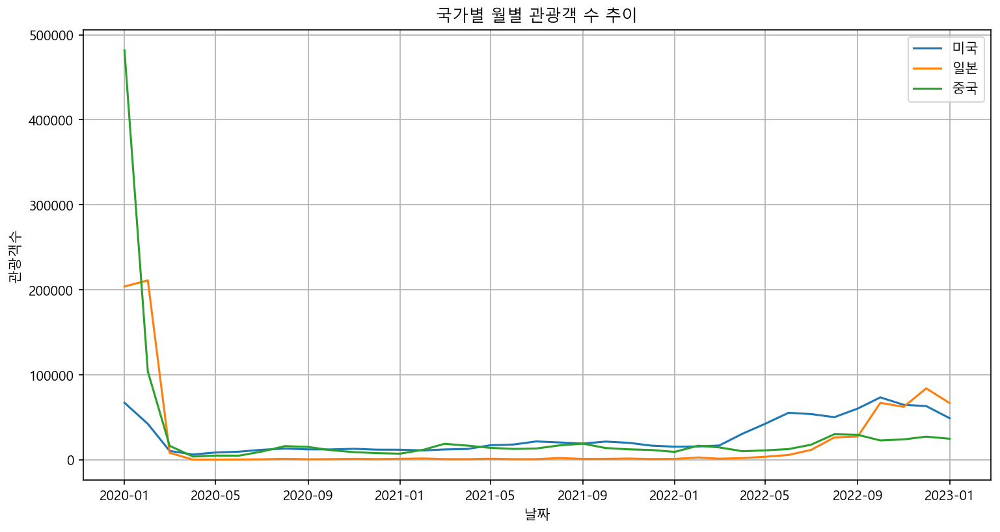

# 2020-2023년 미국, 일본, 중국 관광객 유입 추세 분석 보고서

> 생성 시간: 2026-04-09 18:18:35

## 분석 목표
한국을 방문한 미국, 일본, 중국 관광객의 추세와 국가별 비교, 변화율을 분석하여 주요 인사이트를 도출한다.

## 데이터 출처
미국, 일본, 중국의 2020년 1월부터 2023년 1월까지의 월별 관광객 수 데이터 (CSV 파일 3종)

---

## 경영진 요약
본 보고서는 2020년부터 2023년까지 한국을 방문한 미국, 일본, 중국 관광객의 추세와 국가별 비교를 분석하였습니다. 분석 결과, 팬데믹 초기 급격한 감소 이후 2022년 하반기부터 전반적인 회복세가 확인되었습니다. 중국이 가장 높은 평균 관광객 수를 기록했으나, 일본은 높은 변동성을, 미국은 안정적인 회복 추세를 보이고 있어 시장별 맞춤형 대응 전략이 요구됩니다.

## 주요 발견사항
- 전체 관광객 수는 2020년 초 급감한 이후 장기간 정체기를 거쳐 2022년 하반기부터 완만한 회복세를 보임.
- 중국이 평균 월 29,971명으로 가장 많은 관광객을 유치했으며, 미국(27,492명), 일본(21,885명) 순으로 나타남.
- 일본 시장은 평균 변화율이 21.85%로 가장 높아 관광객 수의 변동성이 매우 큼.
- 미국 시장은 가장 안정적인 회복 추세를 보이며, 2022년 4월 최대 변화율(82.00%)을 기록하며 회복을 주도함.

## 핵심 지표

| 지표명 | 값 | 변화 |
|--------|-----|------|
| 미국 평균 관광객 수 | 27,492명 | - |
| 일본 평균 관광객 수 | 21,885명 | - |
| 중국 평균 관광객 수 | 29,971명 | - |

---

## 과제별 분석 결과

### 과제 1: 국가별 전체 관광객 추세 파악

**질문:** 2020년부터 2023년까지 미국, 일본, 중국 관광객의 전체적인 추세는 어떠한가?

*2020년 초 급격한 하락 이후 장기간 낮은 수준을 유지하다가, 2022년 하반기부터 완만한 상승 곡선을 그리며 회복세로 전환됨.*

**인사이트:** 팬데믹으로 인한 관광 산업의 타격이 컸으나, 2022년 하반기부터 회복의 신호가 뚜렷하게 나타나고 있음.

### 과제 2: 국가별 관광객 수 비교

**질문:** 미국, 일본, 중국 관광객 수의 월별 차이는 어떠한가?

*중국은 초기 높은 수치를 기록했으나 급감했고, 일본은 변동폭이 매우 크며, 미국은 상대적으로 완만하고 안정적인 추세를 보임.*

| 국가명 | 평균 관광객 수 | 최대 관광객 수 | 최소 관광객 수 |
|---|---|---|---|
| 미국 | 27,492 | 73,560 | 6,417 |
| 일본 | 21,885 | 211,199 | 360 |
| 중국 | 29,971 | 481,681 | 3,935 |

**인사이트:** 국가별로 관광객 유입 패턴이 상이하며, 특히 일본의 변동성이 가장 두드러짐.

### 과제 3: 국가별 관광객 변화율 분석

**질문:** 기간 동안 국가별 관광객 수의 변화율은 어떻게 되는가?

| 국가명 | 평균 변화율(%) | 최대 변화율(%) | 최대 변화율 시점 |
|---|---|---|---|
| 미국 | 3.11 | 82.00 | 2022-04 |
| 일본 | 21.85 | 156.30 | 2021-08 |
| 중국 | 2.65 | 92.79 | 2020-08 |

**인사이트:** 일본 시장의 변화율이 압도적으로 높아 시장 예측 및 대응에 높은 유연성이 필요함.

---

## 종합 결론
관광 산업은 팬데믹으로 인한 장기 침체기를 지나 2022년 하반기부터 본격적인 회복세로 전환되었습니다. 국가별로 회복 패턴과 변동성이 상이하므로, 시장별 특성에 맞춘 차별화된 마케팅 전략 수립이 필수적입니다.

## 제언
1. 미국 시장의 안정적인 회복 추세를 활용하여 장기 체류형 프리미엄 관광 상품을 확대할 것.
2. 일본 시장의 높은 변동성을 고려하여, 수요 급증 시기에 즉각 대응 가능한 유연한 마케팅 캠페인을 운영할 것.
3. 중국 시장의 높은 잠재력을 고려하여, 여행 제한 완화 시점에 맞춰 대규모 프로모션을 집중할 것.

---

## 참고사항
본 분석은 2020년 1월부터 2023년 1월까지의 데이터를 기반으로 수행되었습니다. 향후 분석 시에는 항공편 운항 횟수, 비자 정책 변화 등 외부 요인을 추가하여 더 정밀한 예측 모델을 구축할 것을 제안합니다.
